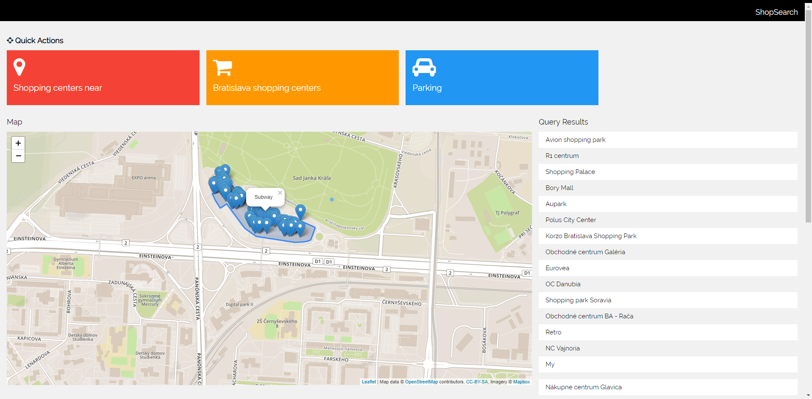

# Overview
Author: Lukas Belaj

Application provides overview of shopping centers and malls around Bratislava and nearby villages.
Features:
- Filter out nearby shopping malls based on actual location
- Provide overview of all shopping centres in Bratislava
- Show shops and other amenities in shopping malls
- Show shopping centres with parking lots and coresponding roads

This is ShopSearch in action:

The application consists of 2 parts, the client which is a [frontend web application](#frontend) is using [knockout.js](https://knockoutjs.com/), [leaflet](https://leafletjs.com/) with [mapbox](https://www.mapbox.com) tiles to show data. The [backend application](#backend) written in Typescript runs on [node.js](https://nodejs.org/en/) with [Express](https://expressjs.com/), it is connected with Postgre database (with PostGIS). Connection between node.js an database is hanled by [node-postgres](https://node-postgres.com/). The frontend application communicates with backend using a [REST API](#api).

# Frontend

The frontend application is (`index.html`) webpage with dynamic bindings made by [knockout.js](https://knockoutjs.com/), page uses w3.css template with some rework. Geographical data are shown on leaflet map, which is using mapbox tiles. Most of the frontend logic is handled in included script `main.js`, which contains all the functions and knockout viewmodel.

The fronted contains simple buttons to retriev current location with nearby shopping malls, all shopping malls or filter shops by mall. User can interact with mall polygons on map or with the query result table. Clicking on either of them results in retrieving shops within selected mall.

Geofeature are retrieved from server in geojson format so they are directly provided to leaflet and shown on the map.
Application uses standard geolocation [web location API](https://developer.mozilla.org/en-US/docs/Web/API/Geolocation/Using_geolocation)

# Backend

The backend runs on node.js with [node.js](https://nodejs.org/en/) with [Express](https://expressjs.com/) framework. It handles database communication with  [node-postgres](https://node-postgres.com/) extension.

## Data

Data come from Open Street Maps. I downloaded an extent covering Bratislava and nearby villages up to Čierna voda and imported it using the `osm2pgsql` tool. To speedup the queries I created an index on geometry column (`way`) in polygons table and also index on amenity collumn as I use it recognize shopping centres and malls.
To make shop retrieving process easier, I have created shops view providing polygon in geojson and shops name. Because of the fact tha shopping malls frequently consist of multiple polygons, I grouped results by name an merged polygons using ST_UNION function.
GeoJSON is generated by using a standard `st_asgeojson` function.

I also created ways_parking view where aj merge intersecting roads to malls an union them with parking lots from polygons table.

## Api

**Find all shopping centres in dataset, sorted by size of their area**

`GET /api/allshops`

**Find shopping centers in specified radius from specified lat, lon**

`GET /api/allshops/:lat/:lon/:radius`

**Find all amenities within shopping centre**

`GET /api/mall/:name`

**Find parking place**

`GET /api/parking`

### Response

API responds with json containing 2 keys, `name` and `geojson`. 
{
  "name": "Aupark",
  "geojson": contains a geojson with shop point, shopping mall polygon, or object with ways and parking lots.
}

